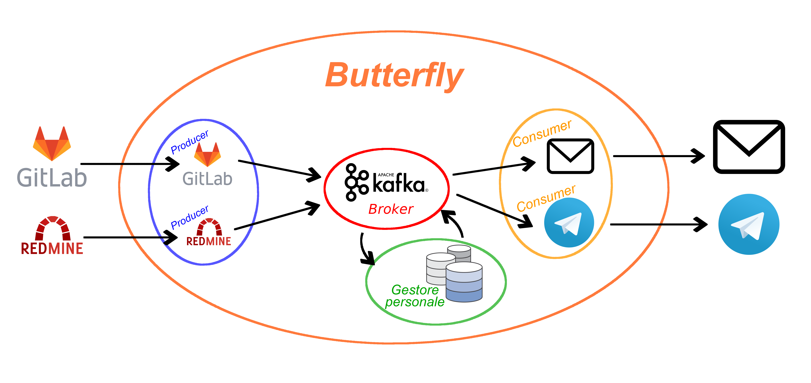

# Butterfly

**Butterfly** è un software che permette la configurazione dell'inoltro dei messaggi da parte di **Redmine** e **Gitlab** agli utenti tramite **Telegram** ed **Email**, passando per il Broker **Apache Kafka** che comunica con un **Gestore Personale** che contiene tutte le preferenze degli utenti e quindi la logica degli inoltri. Questo prodotto è stato sviluppato come progetto di gruppo per il progetto della materia **Ingegneria del Software** dell'Anno Accademico 2018/2019 dei professori [Tullio vardanege](https://www.math.unipd.it/~tullio/) e [Riccardo Cardin](https://www.math.unipd.it/~rcardin/).
Il gruppo che lo ha sviluppato si chiama AlphaSix ed è composto da:
- [Ciprian Voinea](https://www.linkedin.com/in/cvoinea/)
- [Timoty Granziero]() 
- [Laura Cameran]()
- [Samuele Gardin](www.linkedin.com/in/samuele-gardin)
- [Matteo Marchiori]()
- [Nicola Carlesso]()

La figura proponente di questo progetto è [Imola Informatica](https://www.imolainformatica.it/home/) che ha fornito il seguente capitolato che descrive i requisiti richiesti per il Butterfly:
- [capitolato fornito](http://www.math.unipd.it/~tullio/IS-1/2018/Progetto/C1.pdf)
- [slide di presentazione](https://www.math.unipd.it/~tullio/IS-1/2018/Progetto/C1p.pdf)



Butterfly utilizza l'architettura **Publisher Subscriber** ed è stato pensato in maniera da suddividerlo in più sottosistemi: quello dei Producer, dei Consumer, del Gestore Personale e del Broker.

# Docker e Rancher
Sotto richiesta dell'azienda proponente, Butterfly è stato sviluppato in maniera tale che funzioni su container **Docker** e la loro istanziazione venga fatta tramite un gestore di oggetti Kubernetes come **Rancher**. Il seguente README fa riferimento ad un sistema su quale questi due sono correttamente installati e configurati.

## DockerHub:

Le immagini di Docker corrispondenti ai vari container sono presenti anche su **[DockerHub](https://hub.docker.com/u/alphasix)** dove sono state configurate le **Automated Builds** sul branch master.

**Producer GitLab** : [](https://cloud.docker.com/u/alphasix/repository/docker/alphasix/producer-gitlab) [](https://cloud.docker.com/u/alphasix/repository/docker/alphasix/producer-gitlab) [](https://cloud.docker.com/u/alphasix/repository/docker/alphasix/producer-gitlab)

**Producer Redmine** : [](https://cloud.docker.com/u/alphasix/repository/docker/alphasix/producer-redmine) [](https://cloud.docker.com/u/alphasix/repository/docker/alphasix/producer-gitlab) [](https://cloud.docker.com/u/alphasix/repository/docker/alphasix/procuder-redmine)

**Consumer telegram** : [](https://cloud.docker.com/u/alphasix/repository/docker/alphasix/consumer-telegram) [](https://cloud.docker.com/u/alphasix/repository/docker/alphasix/consumer-email) [](https://cloud.docker.com/u/alphasix/repository/docker/alphasix/consumer-telegram)

**Consumer mail** : [](https://cloud.docker.com/u/alphasix/repository/docker/alphasix/consumer-email) [](https://cloud.docker.com/u/alphasix/repository/docker/alphasix/consumer-email) [](https://cloud.docker.com/u/alphasix/repository/docker/alphasix/consumer-email)

**Gestore Personale Client** : [](https://cloud.docker.com/u/alphasix/repository/docker/alphasix/gestore-personale-client) [](https://cloud.docker.com/u/alphasix/repository/docker/alphasix/gestore-personale-client) [](https://cloud.docker.com/u/alphasix/repository/docker/alphasix/gestore-personale-client)

**Gestore Personale** : [](https://cloud.docker.com/u/alphasix/repository/docker/alphasix/gestore-personale) [](https://cloud.docker.com/u/alphasix/repository/docker/alphasix/gestore-personale) [](https://cloud.docker.com/u/alphasix/repository/docker/alphasix/gestore-personale)

## Istanziazione dei container su Rancher
Abbiamo sviluppato i **Dockerfile** in maniera tale da suddividere il progetto in 6 container:
- **[Producer](./Butterfly/producer/README.md)**: GitLab e Redmine
- **[Consumer](./Butterfly/consumer/README.md)**: Telegram e Email
- **[Gestore Personale](./Butterfly/consumer/README.md)**: un client e un controller

Questi vengono descritti in particolare nelle rispettive cartelle in cui è anche contenuto il codice oltre che nella documentazione prodotta insieme al software.

Su Rancher abbiamo pensato di suddividere un nodo che ci è stato fornito dall'azienda come ambiente di lavoro in maniera tale che ci fossero i seguenti namespace:
- **producer** : con istanziati i container dei producer
- **consumer** : con istanziati i container dei consumer
- **gestore-personale** : con istanziati i container del gestore personale e MongoDB presente su [DockerHub](https://hub.docker.com/_/mongo)
- **kafka** : con istanziato il container di Kafka presente nello store di container scaricabili in  Rancher
- **gitlab** : con istanziato il container di GitLab presente nel [DockerHub](https://hub.docker.com/r/gitlab/gitlab-ce/)
- **redmine** : con istanziato i container di Redmine e Postgress presenti nel [DockerHub](https://hub.docker.com/_/redmine)

---------------------------------------

# Configurazione del sistema Butterfly
Viene fornito il file `docker-compose.yml` che contiene la configurazione automatica del sistema e per i servizi che vengono utilizzati dalla nostra applicazione.<br>
Come prerequisito è necessario avere almeno la **versione 18.09 di Docker** installata nel sistema.

## Configurazione file di log
Per ciascun container vengono salvati file di log in formato json. Un prerequisito per poterli utilizzare è specificare il driver di logging di default e le opzioni dei log nel file `/etc/docker/daemon.json` copiando il seguente snippet:

	{
	  "log-driver": "json-file",
	  "log-opts": {
	    "max-size": "10m"
	  }
	}
	
In caso questo file non dovesse esistere crearlo con `sudo touch /etc/docker/daemon.json`. <br>
Per ulteriori informazioni riferirsi alla documentazione ufficiale a [questo link](https://docs.docker.com/v17.09/engine/admin/logging/json-file/#usage).

## Dockerfile
Per costruire le immagini necessarie per ciascun servizio creato da noi eseguire i comandi dall'interno della cartella Butterfly:

	$ docker build --no-cache --tag consumer_telegram -f path/to/Dockerfile .
Il path relativo a ciacun Dockerfile è quello relativo al servizio di cui si vuole creare l'immagine.
Per i **producer**:
	
	$ docker build --no-cache --tag producer_redmine -f producer/redmine/Dockerfile . ;
	$ docker build --no-cache --tag producer_gitlab -f producer/gitlab/Dockerfile . ;
Per i **consumer**:
	
	$ docker build --no-cache --tag consumer_email -f consumer/email/Dockerfile . ;
	$ docker build --no-cache --tag consumer_telegram -f consumer/telegram/Dockerfile . ;

## docker-compose
Per far costruire automaticamente l'ambiente necessario al corretto funzionamento del sistema, eseguire il seguente comando dall'interno di questa cartella (dove è presente il file `docker-compose.yml`):
 
 	$ docker-compose up -d ; 
 	
L'opzione `-d` è utilizzata per effettuare il `detach`, ovvero il processo viene eseguito in maniera headless, diventando quindi un daemon che continua la sua esecuzione in background.

## Configurazione dei servizi
Dopo aver eseguito il comando descritto precedentemente i servizi verranno configurati nel seguente ordine e saranno accessibili tramite le porte specificate nel file di configurazione.
 
* **Jenkins** :
Il binding delle porte che viene effettuato per questo servizio sono:

	- *1500 : 8080* per interfacciarsi tramite HTTP
	
	Per poter quindi accedere ai servizi web del container sul quale viene eseguito Jenkins andare dal browse alla pagina `IP_CONTAINER:1500/`. Verrà richiesta una password di amministrazione per poter sbloccare Jenkins e continuare quindi con la configurazione. 
	Tale password può essere visualizzata eseguendo sul container il comando:
	
		$ cat /var/jenkins_home/secrets/initialAdminPassword
	
	Successivamente si potrà procedere con la configurazione dei plugin e utilizzare dunque il servizio. <br>
	Per ulteriori informazioni riferirsi alla [documentazione ufficiale](https://github.com/jenkinsci/docker/blob/master/README.md).

* **Gitlab** :
Il binding delle porte che viene effettuato per questo servizio sono:
    - *4080 : 80* per interfacciarsi tramite HTTP
    - *4443 : 443* per interfacciarsi tramite HTTPS
    - *4022 : 22* per interfacciarsi tramite SSH

    Per poter quindi accedere ai servizi web del container sul quale viene eseguito GitLab andare dal browse alla pagina ```IP_CONTAINER:4080/``` oppure ```IP_CONTAINER:4443/```.
Per motivi di sicurezza, verrà richiesto di impostare una password per l'utente `root`, successivamente si potrà accedere tramite tale account con la password impostata oppure creare nuove utenze.
Successivamente si potrà accedere in maniera completa ai servizi offerti da GitLab.
Per ulteriori informazioni riferirsi alla [documentazione ufficiale](https://docs.gitlab.com/omnibus/docker/).

* **Redmine** :
Il binding delle porte che viene effettuato per questo servizio sono:
	- 3000 : 3000  per interfacciarsi tramite HTTP
	
	Per la prima autenticazione utilizzare le credenziali 
		
		username: admin 
		password: admin
	Come per GitLab, per motivi di sicurezza, dopo aver eseguito il login, verrà richiesto che queste siano cambiate. Successivamente si potrà accedere in maniera completa ai servizi offerti da Redmine.
	All'interno della cartella `docker/plugins/redmine` è presente il plugin **Redmine WebHook Plugin** per poter utilizzare il servizio di notifica tramite webhook all'accadere di eventi come ad esempio creazione o modifica di issue. Dopo che il container viene creato si può utilizzare questo plugin senza aver bisogno di effettuare ulteriori comandi di  configurazioni.
Per funzionare correttamente è necessario un database **Postgres**.
Per ulteriori informazioni relativi all'istanza di Redmine su Docker riferirsi alla [documentazione ufficiale](https://hub.docker.com/_/redmine).
Per ulteriori informazioni relativi al plugin Redmine WebHook Plugin riferirsi alla [documentazione ufficiale](https://github.com/suer/redmine_webhook).

* **Producer Gitlab** :
Per ulteriori informazioni sul Producer GitLab fare riferimento al file [README.md](../producer/gitlab) presente nella cartella apposita. 

* **Producer Redmine** :
Per ulteriori informazioni sul Producer Redmine fare riferimento al file [README.md](../producer/redmine) presente nella cartella apposita. 

* **Consumer e-mail** :
Per ulteriori informazioni sul Consumer e-mail fare riferimento al file [README.md](../consumer/redmine) presente nella cartella apposita. 

* **Consumer Telegram** :
Per ulteriori informazioni sul Consumer Telegram fare riferimento al file [README.md](../consumer/telegram) presente nella cartella apposita. 

* **Apache kafka** e **Apache Zookeper**:
Vengono istanziati i servizi di Apache Kafka e Zookeeper in modo tale da poter mettere in comunicazione fra di loro *producer* e *consumer* tramite immagini di confluent.
Per ulteriori informazioni relativi all'istanza di Docker riferirsi alla [documentazione specifica](https://github.com/confluentinc/cp-demo)  alle immagini utilizzate.

* **Gestore personale**
TODO
Per ulteriori informazioni sulla nostra configurazione di Apache Kafka fare riferimento al file [README.md](../kafka) presente nella cartella apposita.
 
## Visualizzazione dei file di log
Per ciascun container, i file di log sono disponibili nella cartella  `/var/lib/docker/containers/ID_CONTAINER` e sono di tipo `*-json.log`.
L' ID_CONTAINER può essere recuperato tramite il comando 
	
	$ docker ps ;
		
## Strumenti di terze parti
Per facilitare la gestione dei container e velocizzare il modo di interfacciarsi con questi è stato utilizzato un software di terze parti chiamato [*DockStation*](https://dockstation.io/).

# Connessione ai cluster aziendali (da togliere in repo pubblica)
Per potersi collegare ai cluster aziendali id *Imola Informatica* e testare l'applicazione sulle loro macchine è necessario eseguire i seguenti passi:

1. Aggiungere la riga `nameserver 192.168.188.3` in fondo al file `/etc/resolv.conf`. Questo comando server per aggiungere il puntatore al server pfSense (Firewall) del laboratorio aziendale in quanto il DNS non è automatico.
**N.B.** : In caso successivamente la connessione non dovesse funzionare, tornare a questo passo e commentare all'interno del file altre eventuali righe con `nameserver xxx.xxx.xxx.xxx` che possono essere presenti.

2. Dall'interno della cartella `pfSense-xen1-UDP4-1194` eseguire il comando

		$ sudo openvpn --script-security 2 --config pfSense-xen1-UDP4-1194.ovpn ;
Le credenziali richieste sono:

		username: alpha6
		password: emuoOn2O
		
3. Lasciare il terminale aperto ed entrare con ssh (tramite shell o applicazioni come *FileZilla* o *Nautilus*) all'indirizzo `alpha6-rancher-node.imolab.it` con le seguenti credenziali:
	
		username: root
		password: emuoOn2O

4. I servizi dei container sono accessibili da browser con l'indirizzo: `alpha6-rancher-node.imolab.it:PORT`
